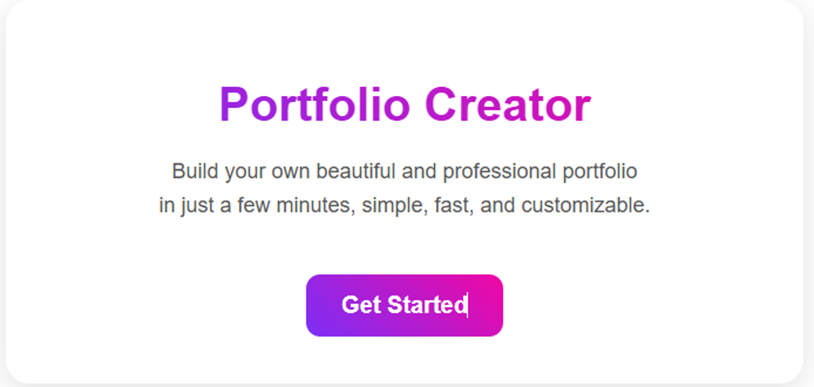
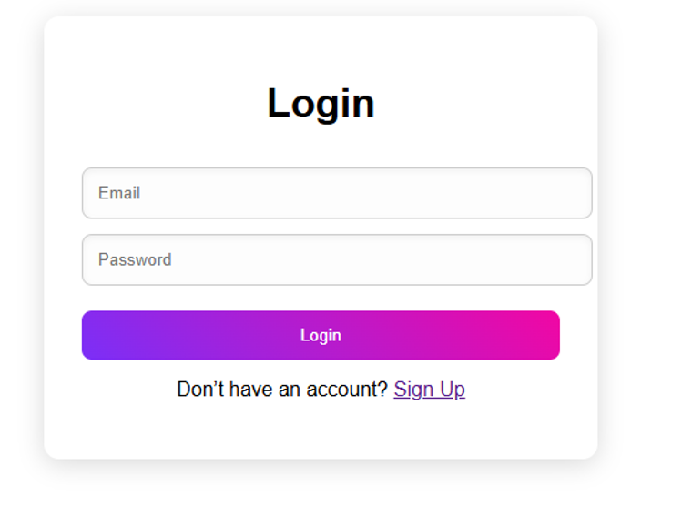
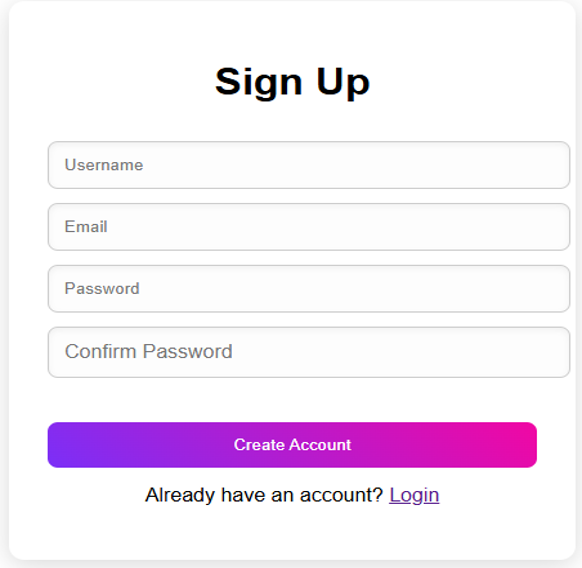
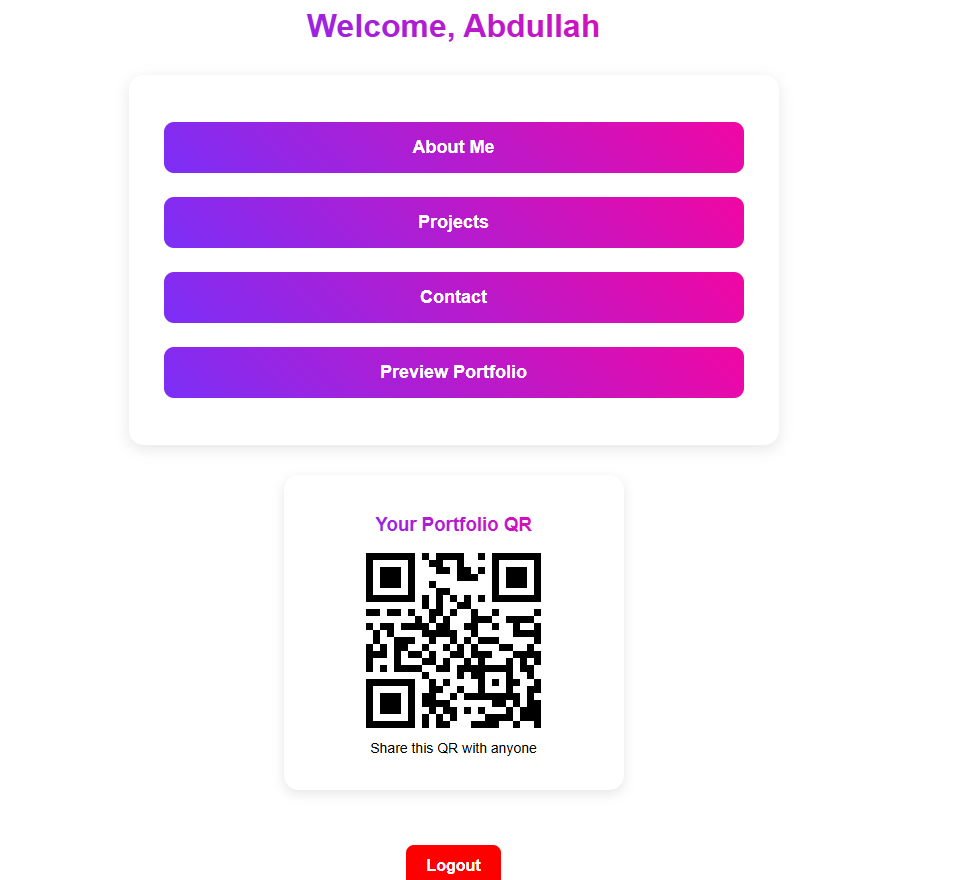
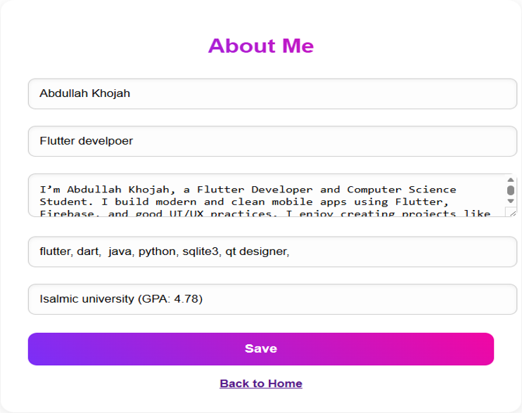
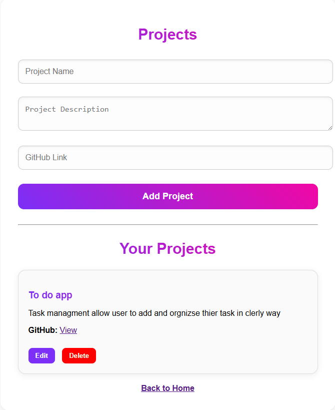
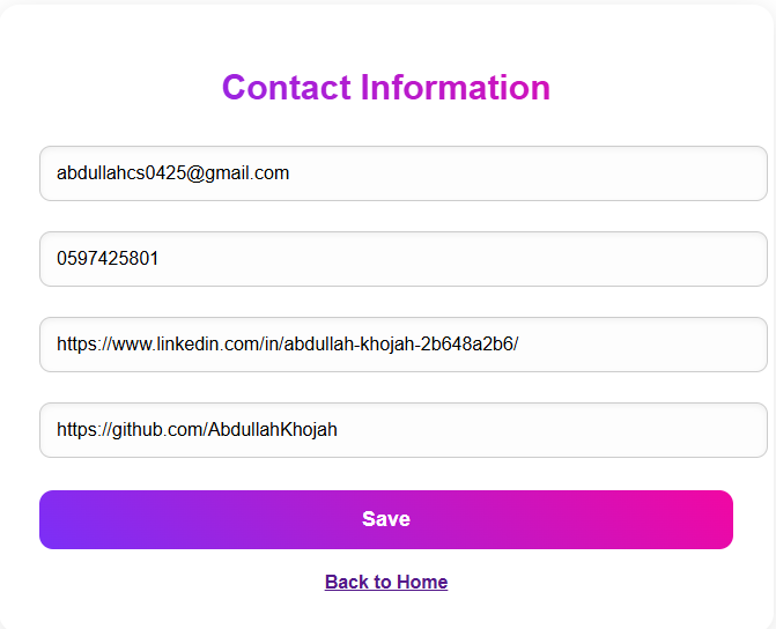
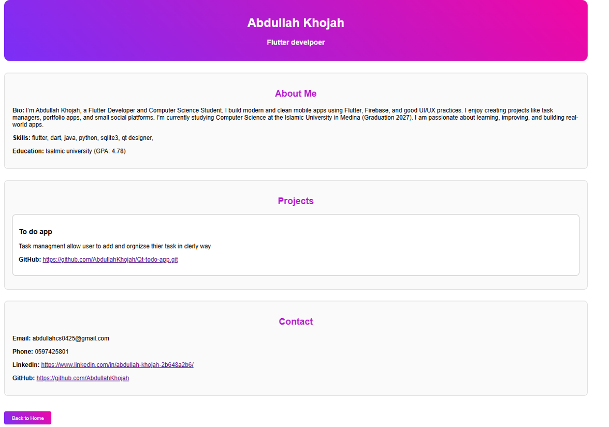

# Portfolio Creator

**Portfolio Creator** is a user-friendly web application designed to help individuals build professional portfolios without requiring any technical skills.  
The system provides a streamlined workflow that allows users to manage personal information, showcase projects, and generate a shareable live preview with a QR code.

---

## 🚀 Features

- **User Authentication**  
  Secure signup and login functionality using **bcrypt** for password hashing.

- **Dynamic Dashboard**  
  A central hub to manage and navigate all portfolio sections.

- **Portfolio Management**
  - **About Me**: Edit personal details such as name, role, bio, skills, and education.
  - **Projects**: Add, edit, and delete projects with descriptions and GitHub links.
  - **Contact Info**: Manage LinkedIn, GitHub, email, and phone number.

- **Live Preview**  
  Instantly view the final professional portfolio layout.

- **QR Code Integration**  
  Automatically generates a QR code for easy sharing of the portfolio.

---

## 🛠️ Tech Stack

- **Backend**: Flask (Python)
- **Frontend**: HTML, CSS
- **Database**: SQLite3
- **Security**: Bcrypt (password hashing)

---

---

## 📸 Screenshots

  
  

  
  

  
  

  
  

> The screenshots above show the full user flow of the application, from authentication to portfolio creation and live preview.

